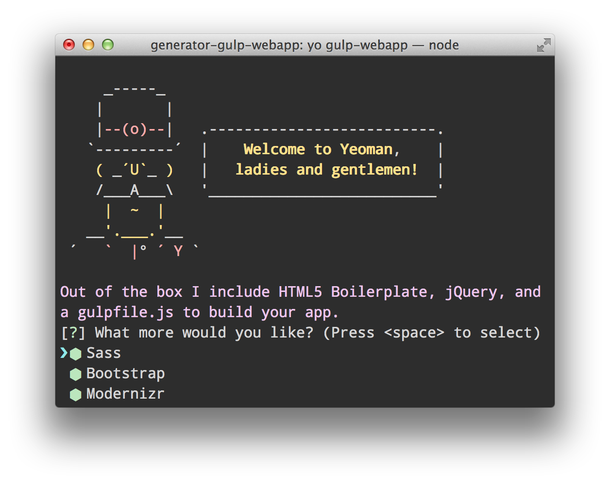

#Modern web development

Time was building a site was a matter of html and css with the occasional javascript. Nowadays it's messier. For really simple stuff, it can still be the holy trinity of html/css/js but that's just for kids. To take it further, there's quite a bit of new stuff to contend with:

* task runners: [grunt](http://gruntjs.com/), [gulp](http://gulpjs.com/), [brunch](http://brunch.io/)
* [sass](http://sass-lang.com/)/[less](http://lesscss.org) and their transpilers (e.g. [libSass](http://sass-lang.com/libsass) and mixins (e.g. [Bourbon](http://bourbon.io/))
* scaffolding tools (e.g. [yeoman.io](yeoman.io), [slush](http://slushjs.github.io/#/))
* [nodejs](https://nodejs.org/) platform with [npm](https://www.npmjs.com/) and its packages
* front-end package manager (e.g. [bower](http://bower.io/), [jam](http://jamjs.org/))
* javascript competitors (e.g. [Typescript](http://www.typescriptlang.org/), [Coffeescript](http://coffeescript.org/))
* front-end css UI frameworks ([Bootstrap](http://getbootstrap.com/), [Purecss](www.purecss.io))
* jquery & jquery plugins ([jQuery Plugins Registry](https://plugins.jquery.com/), [Libraries.io](https://libraries.io/))
* various toolkit addons (e.g. [Emmet](http://emmet.io/), minification & globbing [resources](https://developers.google.com/speed/docs/insights/MinifyResources))
* templating engines (e.g. [Handlebars](http://handlebarsjs.com/), [Jade](http://jade-lang.com/), [Haml](www.haml.info))
* synchronised testing tool (e.g. [Browsersync](http://www.browsersync.io/), [LiveReload](http://livereload.com/))
* debugging tools (e.g. [Chrome DevTools](https://developer.chrome.com/devtools), [Firefox Firebug](http://getfirebug.com/))
* performance measuring and refinement (e.g. [PageSpeed](https://developers.google.com/speed/pagespeed/insights/), [GTmetrix](https://gtmetrix.com/))
* editors & IDEs: (e.g. [Sublime Text](http://www.sublimetext.com/), [Atom](https://atom.io/), [CodeKit](https://incident57.com/codekit/), [WebStorm](https://www.jetbrains.com/webstorm/)

That's a pretty long list and exclusively lives (with possible debate about templating engines) on the *client* side of the equation. The server-side is another ball game. Nor does this list (in the main) touch on the CMS arena which in effect masks a lot of these topics & tools. While CMSs can bring significant productivity boosts by doing so, they also introduce (to my mind) equally problematic issues. Finding a CMS that meets your needs can be difficult. For example, [Wordpress](https://wordpress.org/), released in 2004 dominates with about 23% of the CMS market share. Having used it a lot (though not a great technical depth), I really dislike it. For me, it's slow, in-secure and makes the task of UI styling un-necessarily difficult (imho). But server-side & CMS discussion is off-topic.

### How did we get here?
At the dawn of the internet, none of this was necessary. Adobe Dreamweaver brought some of the emerging complexity under its umbrella - for a time. The platform (i.e. the browser) kept shifting and users' expectations broadened. To keep pace, the tooling needed to step up. The big players largely missed the boat and the open-source community picked up the slack - virtually all the tools/tech mentioned above are open-source. And without a galvanising force of a large player (such as Microsoft for .NET), a lot of disparate development infrastructure evolved (and often demised). However, the flip-side of this is a kind of Darwinian survival of the fittest and that jostling for position continues today. For example, Grunt as a task runner is under assault from Gulp. Just as NodeJS is taking business from Apache. It's probably a *good thing* - but lousy for programmers!

### Where to start?
For beginners it's probably easy enough to understand the purpose of any one tool. For example, sass is a superset of css - in effect a better css. And the rationale is reasonably straightforward - to lend greater expressiveness to your styling. What may not be as clear is how all the pieces fit together.
I recently put together a simple one-page 'site' as a landing page to a couple of my main sites. In doing so, I hastily threw together a single *index.html* in Sublime Text. Surely, I didn't need anything from that list above? But I quickly found I did - and quite a lot of it. So taking that exceptionally simple *site*, here's what modern web development tooling has to offer even in this minimalist case.

#### Editor
Easy one to start with. [Sublime Text](http://www.sublimetext.com/) (ST v3 surely winning prize for longest running [beta](http://www.sublimetext.com/3)) is an industry standard. Together with its [packages](https://packagecontrol.io/) (yes, even editors have package managers nowadays), you have a worthy alternative to big IDEs - and fast. As an example, I use [SFTP](http://wbond.net/sublime_packages/sftp) to push changes locally to my production FTP server on my hosting. I also use [Forklift](http://www.binarynights.com/forklift/) but SFTP makes deployment a breeze.
Occasionally, I'll use JetBrain's [WebStorm](https://www.jetbrains.com/webstorm/), though mostly for AngularJS applications.
#### Testing
Chrome is far from my favourite browser anymore - now entering middle-age, it's putting on weight, demanding and cranky. But it does have the best debugging tool around - DevTools. So grab a copy of *[The Great Suspender](https://github.com/deanoemcke/thegreatsuspender)* to reduce the hogging of resources that all those tabs brings and you're good to go.
As a local web server, [MAMP](https://www.mamp.info/en/) or [WAMP](http://www.wampserver.com/en/) are both serviceable. I prefer running a server straight from the command shell (see [localhost](/blog/localhost-options) post). If using one of the task runners mentioned, you'll likely have this automated for you.
#### Command Shell
While Sublime Text (ST) handles editing needs well, you'll want a command shell to, well, issue commands - most of the tooling in the list (are you sitting down?) are invoked via command line. For some, this is anachronistic and [neo-Luddism](https://en.wikipedia.org/wiki/Neo-Luddism). For me, it's a simple matter of the best tool for the job and GUIs just don't hack it here so let's move on.
For Windows users the solution is to buy a Mac. Seriously, though, while Windows is good in certain areas, I've found web development far more productive on Apple hardware. If that's not an option, use any of the command shells mentioned [here](http://superuser.com/questions/608106/how-can-i-use-a-bash-like-shell-on-windows). For Mac, [iTerm2](https://iterm2.com/shell_integration.html) is a favourite but even the built-in Terminal is sufficient.
#### Version Control
[Git](www.git-scm.org) is the obvious choice here. If you need convincing about the necessity for Git, then this post isn't for you. And though the investment in learning Git isn't insignificant, it's worth the effort. I've still to see a GUI client to rival the command line interface. [Github](www.github.com), [Bitbucket](www.bitbucket.com) or [GitLab](https://about.gitlab.com/) are useful to include to.

>So taking stock at this point, we are at the starting blocks to begin *coding* the mini-site. In truth, these steps are appropriate to a lot of coding projects for the web.

The page I was created called for some simple enough CSS animation (backed by some JS). It also needed a full-screen background image (a responsive one) that was easiest to achieve using a jQuery plugin ([Superslides](https://github.com/nicinabox/superslides)). The CSS animation came from courtesy of [Codyhouse](http://codyhouse.co/demo/animated-headlines/index.html) and is actually based around SCSS.
So these introductions mandated *jQuery* and *SASS*. Easy enough - I could get jQuery to [download](https://jquery.com/download/) and could [transpile](http://sebastianpontow.de/css2compass/) SASS online.
However any changes to the SASS required a roundtrip to transpile. And to deploy, I would need to minify (strip out all spaces) and glob (concatenating together) these files. And should I wish to make even a small change later, this process needed repeating. Not a good strategy.

####Task Runners
This leads nicely to the need for task runners such as [Gulp](http://gulpjs.com/) and [Grunt](http://gruntjs.com/). They help automate web dev jobs like:
* css/js/html minification, globbing and gzipping
* transpiling sass & less
* compiling [markdown](http://daringfireball.net/projects/markdown/) to html
* launching localhost
* optimising images for deployment
* and much more

####Gulp
{.img-float-left}

Gulp is a modern task runner. The excerpt above is an example of a task in a `gulpfile.js`. This file typically contains a number of such tasks. 

    gulp.task('styles', () => {
          return gulp.src('app/styles/*.scss')
            .pipe($.plumber())
            .pipe($.sourcemaps.init())
            .pipe($.sass.sync({
              outputStyle: 'expanded',
              precision: 10,
              includePaths: ['.']
            }).on('error', $.sass.logError))
            .pipe($.autoprefixer({browsers: ['last 1 version']}))
            .pipe($.sourcemaps.write())
            .pipe(gulp.dest('.tmp/styles'))
            .pipe(reload({stream: true}));
        });

The one above is run to transpile the sass files in the `app/styles` folder and place the results in the `.tmp/styles` folder. Other tasks will later minify CSS and uglify JS. During development it'll be sufficient to transpile and for later deployment to production, the minification/uglification can be executed.

The `gulpfile.js` governs the available tasks and while not particularly complicated, it's a file that is best provided rather than written from scratch. That's where scaffolding tools, principally **Yeoman** come in. 

####Yeoman
{.img-float-left}

Scaffolding tools are a great starting point for any project. [Yeoman](www.yeoman.io) is the leader here providing >2000 **generators** which provide the starting code and folder structure for a variety of projects. [`gulp-webapp`](https://github.com/yeoman/generator-gulp-webapp) is a good example:
{.img-center}

It brings the following tasks to your project:

* CSS Autoprefixing
* Built-in preview server with BrowserSync
* Automagically compile Sass with libsass
* Automagically lint your scripts
* Map compiled CSS to source stylesheets with source maps
* Awesome image optimization
* Automagically wire-up dependencies installed with Bower

Yeoman is of even greater benefit when building larger web applications including a back-end server component. The generators help with establishing best practice for folder structure and workflow. Regrettably, their documentation could often be better. For example, most generators will employ `nodejs` so that's a prerequisite that needs installing. Then you must install the node packages that `gulp` needs to execute its tasks. That requires a run of `npm install ` to have `npm` look at the provided `packages.json` file where a list of these packages are found. That takes care of the packages required by `gulp` but then it's likely your project will employ an array of front-end packages. And while these are increasingly managed by `npm`, most are handled with a different package manager - `bower`.

####Bower
 {.img-float-right}If you're very observant you'll have seen `bower` mentioned during the `yeoman` generator startup. You may even have noticed that it wasn't successful - just use `sudo bower install` to boost your privileges and get the job done. This is `yeoman` helping to get your project off the ground by installing a number of useful front-end packages e.g. Bootstrap.
The list of `Bower` packages is stored in the `bower.json` file, similar to the `packages.json` file for `npm`. Running `bower install` ensures all the packages referred to in this json file are loaded - and, crucially, so too are their dependencies. This last bit can be nightmarish to manage without a package manager. Later updates to packages are easily handled by `bower update`.
Alternatively, you can indirectly add to the `bower.json` file by installing a package with `bower install the_package --save`. The `--save` switch will ensure the package (and its version details) are recorded to the `bower.json` file. The `--save` bit is important as without it, the package won't be added to the json file and so won't be re-installed by a `bower install` command later.
Using `--save-dev` will add the package as a *dev dependency* - this meaning the package will not be deployed (later) but rather just used during development. The same distinction is appropriate to the `npm` (node package manager) and in truth is more useful there since many node packages are of use only during development (e.g. css-minify).
While the primary benefit of using Bower is the management of package dependencies, there are other shortcuts that relate to it. Many Yeoman generators also include a task to wire up dependencies into your code. So instead of manually inserting the assorted `<link rel='stylesheet'` and `<script src='ajs.js'` lines, a quick call to the appropriate gulp task (e.g. `gulp wiredep`) will create the necessary inserts into your index.html (or equivalent).

####Running your site
Task runners excel when it comes to testing & deploying your site. Typically a call to `gulp serve` will initiate a bunch of sub-tasks that ready your code for execution - e.g. linting (checking your css/js for bad practice/errors), sass-to-css transpiling. Most importantly, it'll use node to spin up a local web server so your browser has somewhere to go look at your site.
I've covered options around creating a [localhost](/blog/localhost) before, but a decent `gulpfile.js` or `gruntfile.js` will have this handled for you.
One other incredibly useful adjunct is a live reload facility - when you make a change to html or sass/css, the task runner will notice and re-run any necessary tasks (sass-to-css) before refreshing the browser window to show the changes. It may sound like a small thing but shrinking that roundtrip adds up to a lot of time saved.

###Wrap-up
So that's a quick drive-by of a typical web dev tool and workflow nowadays. The complexity really stems from the rapid nature by which this tech churns and evolves. It's easy to consider eschewing all this shiny gear and stick with what you know. However the bar is understandably higher these days and an investment of time in these tools will reap significant dividends.
In any case, these tools are currently ubiquitous and you'll stumble into them everywhere you go. Even working recently with statically generated web sites (think Jekyll), I found myself encountering this stuff - so bring on the firehose and start reading.