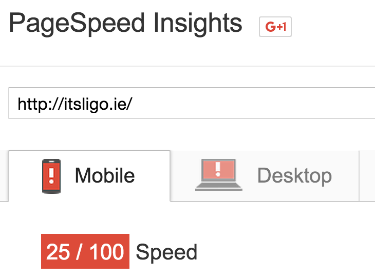
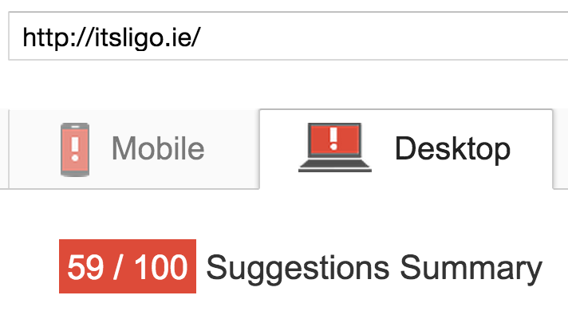
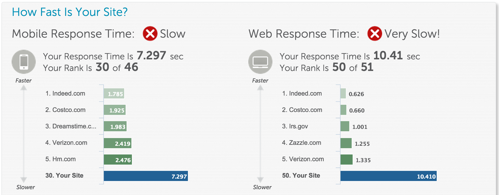
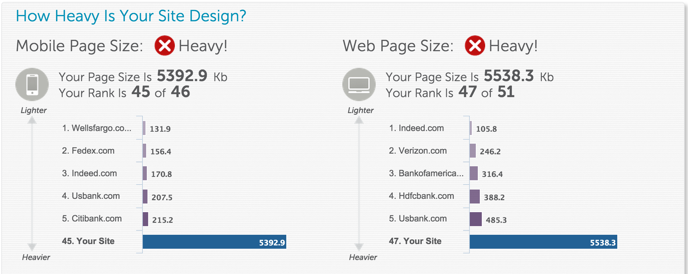
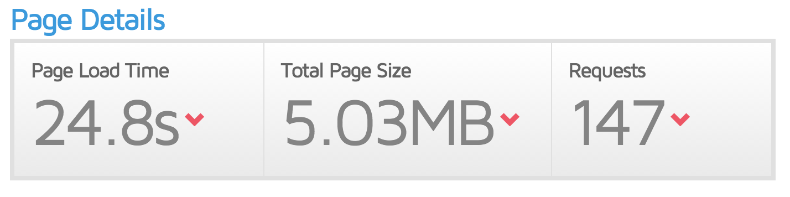
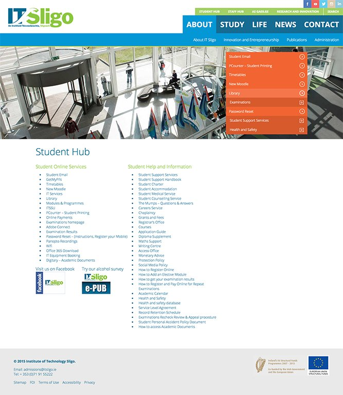

>[www.itsligo.ie](http://www.itsligo.ie) has been live now for 10 months today. While the design is fresh and colourful, the performance and some UX issues need addressing.

##itsligo.ie - First Impressions
I like the dynamic nature and general styling of the new site, certainly a big improvement over the last. It adapts well to mobile in some ways (though not all) but here I'm going to focus on performance and UI issues and let the 'look' be judged by others.

####UI Issues
The design of Higher Education Sites (HEI) is problematic. They have a varied audience with disparate tastes and objectives:

* Current Students - ranging from freshers to post-grads/researchers.
* Prospective students - perhaps from 15 upwards including mature students, post-grad and foreign applicants
* Research/Industry - contacts for research/investment
* Parents of prospective students (or perhaps current)
* Staff
* Community - local community and discipline-based or virtual communities as well as PR

####Wordpress
I should put out an initial rider here - I'm not a Wordpress (WP) fan. I do love the fact that anyone can get a full-featured site (well, blog) up and running in about 1 minute - that's not unique (there are others) but it's still commendable. It's also relatively easy to use and that has earned WP its accolades. However, the honeymoon wears off quickly.

From my experience, it's slow and has a big bulls-eye target on it for hackers. No matter how much I curated WP sites, I was being hacked almost on a monthly basis. And yes I was patching to latest versions as soon as they dropped and I carefully selected themes (a common backdoor for hacking) but nonetheless I was being hit. Never had that level of 'attention' with Drupal, Joomla or Dotnetnuke. And naturally, nothing like that with flat-file CMSs or static-gen sites. But it's the performance that concerned me most - and that doesn't seem to have changed. Now, before we start I agree there are improvements that can be made to ameliorate performance woes but I see too many sites that just don't bother making the effort needed. So let's see how we (at IT Sligo) have faired...

{{page.media['full-page-capture.png'].cropResize(600,1000).html('www.itsligo.ie','www.itsligo.ie','img-center border-light')}}

Running [www.itsligo.ie](http://www.itsligo.ie) through an array of web page metrics here's a smattering of results:

 {.border-light}
Some good news - the site gets Google's approval as being mobile compatible which improves SEO on google searches.

 {.border-light}
Not so good. [Google](http://googlewebmastercentral.blogspot.ie/2015/04/rolling-out-mobile-friendly-update.html) is prioritising its search results for responsive, fast sites - that's sites that look good and perform well on mobile.

 {.border-light}
A score of 59% is better but far below a typical 80% baseline I'd regard as a reasonable speed for desktop.

Two more poor results - there's a pattern beginning here. The site is heavy and slow. There's different reasons behind each but first some more statistics.

There's a lot to report here. Being slower than **96%** of sites tested should grab our attention. Also, 147 hits against the web server is too much. So let's look at the problems:

####Poor CSS handling
There are **18** CSS requests hitting the server. Thankfully most of these (and especially the larger ones) are minified but really these need to be combined so the server is hit only a few times. Or better - use a [CDN](#cdn). Also 121kb for CSS alone would suggest some fat could be trimmed here.
####Poor JS handling
We're looking at **53** server hits for JS alone - yes, really! And they weigh in at 653Kb, even after minifying and gzipping. That's a large payload for a page will few interactive features.
####Server requests
The server is being hammered with **194** requests for just the home page. Fully **109** requests alone come for images. Many of these are reasonably optimised but let's look at just two. The following is a single image from the homepage (21-9-15). 

|Before  | After  |
| ------ | ----------- |
| Size: (2662 kb / 2.6Mb) | Optimised size: (215 kb) ~8% of original|
| Dimensions: 5760x3840 200dpi | Revised dimensions:1152x768, 72dpi |
| {{page.media['homepage-img-1.jpg'].cropResize(400,250).html()}} |  {{page.media['homepage-img-1-opt.jpg'].cropResize(400,250).html()}}
| Before Closeup|After Closeup |
| {{page.media['homepage-img-1-close.jpg'].cropResize(400,250).html()}} |  {{page.media['homepage-img-1-opt-close.jpg'].cropResize(400,250).html()}}
| Further optimised with [TinyPNG](http://tinypng.com) (118kb)  ~5% of original| ...and [JPEG Optimizer](http://jpeg-optimizer.com) (124kb)  ~5% of original|
| {{page.media['homepage-img-1-opt-tiny.jpg'].cropResize(400,250).html()}} |  {{page.media['homepage-img-1-opt-jpeg-optimizer.jpg'].cropResize(400,250).html()}}

This is a particularly stark example for sure. There's a few compounding faults in the image handling:

* **Under-cropped** - the downloaded image is not fully utilised with the visible part only 5760x2192 (remember the image is 3840 tall). This alone would shave a significant **43%** of the download were cropping performed beforehand.
* **DPI too high** - for a majority of screens, 72 dpi is still fine. Here 200dpi is over-kill unless targeting retina screens which is not the case here. Rendering at 72dpi would result in an image **25%** of the original with no discernable difference in appearance on most screens. Curiously, a key brand element, the IT Sligo logo is at too low a resolution weighing in at only 8kb (251px) - rendering very poorly on higher resolution screens.
* **Device aware** - even the highest resolution desktops are throwing away most of the downloaded image. For mobile, only a fraction of the downloaded pixels are consumed. We really should be serving up different resolution images depending on the device. Even on the highest quality retina iPhones, more than half the pixels are thrown away - but (crucially) downloaded.

>The reworked images were rendered through Photoshop CC. The reworked image was exported with 85% quality JPG setting (a reasonable norm).

To be fair, much of the other images are of a reasonable size but new material should be carefully curated to ensure performance doesn't suffer further.

####Smaller images
There are many smaller images bugging the server - ~100 files under 30kb. It's poor practice to hit the server for such small payloads - the act of servicing the request is far more expensive than the quantity downloaded for such small files. Instead, these small images should be grouped into a [CSS image sprite](http://www.w3schools.com/css/css_image_sprites.asp). In this way, a single downloaded image could actually house a large number of smaller images which can then be referenced individually through CSS offsets.

####Fonts
Fonts are a luxury. Sensibly, itsligo.ie employs only two. However you feel about the aesthetics of [Rocksalt](https://www.google.com/fonts/specimen/Rock+Salt), it's a relative heavy font rich in glyphs which I guess is its appeal. But I can find only one instance of its use throughout the site - as overlapping text on the homepage carousel, obscuring as it does the 'expensive' images discussed above.
It's difficult to justify the 50kb hit to the site for such limited usage.

###Video
I like the use of video half-way down the page. But video when poorly managed can add bulk to a site. Fortunately, just as with images, we have a good array of tooling to optimise the medium and gets the best 'bang per buck'. However, this **2.1Mb** movie is not sufficiently finessed to stop it being a heavy resource. 

Here's the original pulled from the site:

I ran it through [Handbrake](https://handbrake.fr) and here's the result:
 

You'll probably agree that there's little appreciable difference in appearance. However, the reworked video weighs in at **1.5Mb** or 71% of the original. Still, though the video is [below the fold](https://en.wikipedia.org/wiki/Above_the_fold), for my liking this is still a big price to pay for the video. But if you look closer at the site you'll notice that the video you see above is actually significantly obscured by other elements of the page. At higher resolutions (e.g. desktops) this is even more obvious. I reworked my optimised video above to represent something similar to that witnessed on the site:

 

This cropped & optimised version weighs in at **1.1Mb** or just over half the size of the original. Again, the viewer will be the judge whether the optimisation 'costs' too much but at these sizes, there is a compromise to be struck. Indeed, [Adobe Media Encoder](https://www.adobe.com/products/media-encoder.html) might well improve matters further beyond what the open-source Handbrake could manage.
Sensibly, the video is swapped for an image on resolutions below 1024px which means mobile users don't take the hit of this video - a good choice.

###CDN
Given the quantity and size of many referenced elements (js/css/img/video), some thought should probably be given to housing this on a CDN. The small invesment would yield important performance benefits.

###Oddities
One of the reasons I'm not a WP fan is the layer of abstraction it forces between the developer and the 'metal'. A good WP developer will peel that away and fully grok the WP codex but for me that's a layer I could well do without. This abstraction I feel often hides problems or idiosyncrascies. For example, the site pulls down two copies of jQuery - one from Google's CDN (version 1.8.3) and the other from the site itself (version 1.11.2). This is odd - it is conceivable that there was a need for a v. ~2.0 along with an older 1.x version to support some legacy plugin - though even here it's hard to make the case for an extra **33kb** to support an old plugin that is surely revised or replaced at this point. jQuery v. 1.8.3 is fully 3 years old. It's more likely one of these is just an oversight or evidence of [technical debt](https://en.wikipedia.org/wiki/Technical_debt).
Another curiosity is the plethora of css/js files seemingly supporting Facebook activity on the site. I counted 13 references to Facebook's CDN (akamaihd.net). I'm not an expert with the Facebook Page Plugin but this is a heavy overhead just to support one feature.

###Other Peformance Fixes
There are many other ways to boost performance which could be addressed here:

* leverage browser caching
* employ a CDN
* reduce blocking resources (js & css) - much of the JS is properly pushed to the end of the page but there's a lot of CSS that could be similarly treated
* minify html

I've written about these methods in another [post](/blog/optimising-web-sites) for those looking for more details.

###Hosting
It came as a bit of surprise that the site is hosted at [Rapidswitch](http://www.rapidswitch.com) - "one of the UK’s leading server hosting companies". I'm sure there's good service to be had but given that a majority of the traffic to the site would originate from Ireland, you might be forgiven for thinking an Irish hosting service would be a more obvious choice.

---
##UI Issues

> Just a quick review but in essence - the core design & page structure falls away quickly the further you delve into the site. The structure of each page **is** a key navigation aid and needs to imprint itself to each page like landmarks that guide a traveller.

The technical observations above are fixable but the goal of decent (no, stellar) user experience requires greater finesse. Home pages need plenty care and attention - they may be your only chance to grab the attention of your audience and lure them deeper into your site. As such, every element of the home page must answer for its place on the page.
Sure, many users will be self-motivated (or have no choice) in using your site but maybe they're your employees and you're paying them to be productive so time is (your) money.

One element that is crucial is navigation. I find the primary navigation at the top of the homepage a little confusing. We're presented with three layers of navigation (four if you count the social links). The lowest of these represents a sub-menu contingent on your choice above it. Indeed, this sub-menu appears quite quickly such that you may not notice it changing to reveal required submenu choices - particularly when one would expect a menu choice to lead to a different page.

This presents a lot of options to users which must be discriminated between. Even apparently obvious links such as 'Contact' aren't answered competently. For example, one would expect 'Contact' to yield a contact form. It instead presents a global email address (info@itsligo.ie) which is itself different to the single email contact provided on the home page - that is provided at the bottom of the list. While talking of emails, the contacts listed don't sport any - bar (reassuringly) our Communications Manager.

I think there is room for some rationalisation of the primary navigation menus (shouldn't it be menu?). I propose the green menu could be subsumed into the main 'About... Study etc.' menu.

###No shortage of navigation
It seems you can't get enough of a good thing. Many of the sub-pages are content poor and link heavy. Take the [Study...Applying...How to apply](http://itsligo.ie/study-at-it-sligo/applying/how-to-apply-2/) link. 

 {.border-light}

That's a lot of navigation!
Once we stray from the main home page, we loose a lot of the structure and many pages have little more than unorganised links to further pages. The student hub page is a good example:

 {.border-light}

Notice how the top green menu offers no indication of the currently selected option. Also, if the user selects from the dark green menu, this doesn't change page until a submenu choice is made. 'Innovation' makes an appearance in the 'About' submenu as well as a category in the top green menu. This makes it difficult for the user to establish a clear mental structure of the various sections.
Choosing 'Research and Innovation' (top green menu) forces a change in 'About' in the lower menu - why? Are these related? No.
At this point a new (orange) menu appears. This is a multi-level menu with distracting animation between selections. Animation is a powerful mechanism to attract attention but in this instance it serves to undermine the user's ability to establish their place in the hierarchy of choices. It also introduces a new navigation instrument - even the colour contrast is poor here.

####Colour blindness
Colour blindness affects approx. 8% of males and 0.5% of females. It's good to see that for all forms of colour blindness, the site performs well providing good contrasts throughout (better, in fact than the oranges mentioned above). In particular, the Deuteranopia form which is the predominant form of colour blindness is well handled.

####Accessibility
Accessibility is a very important element of any site. Previously, Browsealoud was employed on the site but while there is [mention](http://itsligo.ie/accessibility/) of it on the new site, the feature is not enabled. The W3C WAI initiative points the way forward for handling accessiblity issues. [WAI-ARIA](https://developer.mozilla.org/en-US/docs/Web/Accessibility/ARIA/Web_applications_and_ARIA_FAQ) (Accessible Rich Internet Applications) is the specification to employ to make web sites more accessible to a diverse range of users, including those dependant on assistive technologies such as screen readers and magnifiers. Truthfully, there is some effort needed to embrace this reasonable standard and I think, certainly, for public bodies, this should be regarded as a minimum. There is no evidence from a quick inspection of ARIA markup in the site.
Still, even small steps are welcome to enable access to an audience often disadvantaged by the march of technology. The lowest-hanging fruit is to simply provide textual descriptions of key graphics on the site (via **Alt** attributes) - this is readily handled by Wordpress but regrettably not employed to date.
I ran the site through [Voiceover ](http://www.apple.com/ie/accessibility/osx/voiceover/) (Apple have long been supporters of good accessiblity). It's sobering to consider what the world sounds like to those with screen-readers:

<iframe width="100%" height="166" scrolling="no" frameborder="no" src="https://w.soundcloud.com/player/?url=https%3A//api.soundcloud.com/tracks/225556357&amp;color=ff5500&amp;auto_play=false&amp;hide_related=false&amp;show_comments=true&amp;show_user=true&amp;show_reposts=false"></iframe>

---
###Wrap up
I've only scratched the surface here and hope to develop this review further. While there are some faults, the new site is a very welcome development. All sites are 'under construction' so I'm sure the design and content will progress and evolve.

It's clear that while design effort has clearly been given to the top-level pages, there is weak structure to those pages even one-level below. In the absence of a strong navigation which in turn imposes a clear hierarchy of information content, the tendency is to simply provide discrete, disparate links to individual pages. A clear information architecture established early on would enable each of these effectively orphaned pages to find a home within the over-arching hierarchy, grouping similar pages together in logical collections - often facilitated by a technique called [affinity diagramming](http://infodesign.com.au/usabilityresources/affinitydiagramming/).

####Afterthought

I often think that as an institute of education, it would be a good litmus test of our credentials to undergo an exercise (as we say in the software industry) in '[dogfooding](http://www.urbandictionary.com/define.php?term=dogfooding+(to+dogfood))' - to put ourselves to the test and build what we teach. After all, it [takes a village](https://en.wikipedia.org/wiki/It_takes_a_village).