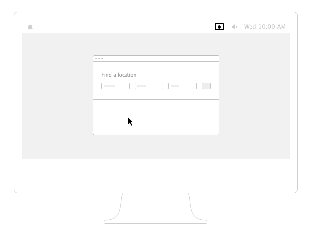
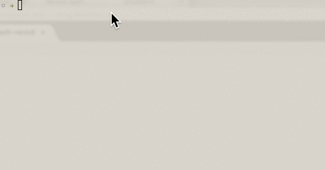

#Recording a bash session

With an increasing amount of development work being conducted through a Unix shell (for me, typically with [iTerm2](https://iterm2.com))), it can be useful to record the commands entered in a meaningful way.
One obvious candidate is to record the interaction as a video. While this is easily done with Quicktime Player on a Mac, the resulting mp4 file can be bulky, even if post-processed. Also, it's overkill for this need and is problematic in posting to blogs etc., especially github pages where 
Another choice is to record the interaction as an animated gif. This works great for any kind of (brief) screen interaction especially when there is little changing in the display. [RecordIt](http://recordit.co) is an excellent tool in this regard, posting your resulting gif online for each insertion into a post or to download and use locally. Here's the GIF walkthrough from their site:


However, shell sessions are predominantly text based and so even animaged GIF-encoding is un-necessary - though would work. Instead, we can use tools such as [ttyrec](http://0xcc.net/ttyrec/index.html.en) which record keyboard activity in the shell. There is even a way to take this interaction and convert it to an animated gif (using [ttygif](https://github.com/icholy/ttygif)). However, my need was for a video-like display of recorded interactivity and to avoid the overhead (and loss of detail) of GIF.

For this need, there are two solutions - [Showterm.io](https://showterm.io) and [Asciinema](https://asciinema.org). Both are quite alike but I'll use Asciinema. These record your interaction at the shell, record it either to a file or uploaded to a cloud hosting provided free by the service. For [Asciinema](https://asciinema.org), full use instructions are [available](https://asciinema.org/docs/getting-started). Here are the instructions to record a session:
```
asciinema rec
# now work with your shell entering commands etc.
# then press CTRL+D to finish recording
# recording finishes and online url provided to the recording
```

Or better, here's a GIF (made with RecordIt) of a sample use of Asciinema:


And here's a sample Asciinema playing:

<script type="text/javascript" src="https://asciinema.org/a/27865.js" id="asciicast-27865" async></script>

As you can see, the quality captured by Asciinema is far superior as it's only capturing keyboard input and recreating it in the player. RecordIt is make an animated GIF which is a lossy format. Incidentally, the GIF weighs in at **115kb** for a ~19 second clip. Asciinema, on the other hand has a JS payload of ~140kb (gzipped) but would be more economical if one or two recordings are downloading in a single page. The quality also is much better. And more importantly, you can select the text in the player if you see a command you like to use.

One last thing - on starting Asciinema, it creates a login shell but doesn't run any customisations you may have in your **.bash_profile** file (e.g. prompt formatting). To make it do so, use `asciinema rec -c "/bin/bash -l"`.

There is another interesting option to Asciinema, [tty-player:video](http://tty-player.chrismorgan.info/) from Chris Morgan. It leverages the concept of [ttyrec](http://0xcc.net/ttyrec/) mentioned above but in this case uses [termrec](http://angband.pl/termrec.html) to record the session to a file. Chris's approach adds a player to playback this recording. Right now, I prefer the Asciinema solution given the ease of inserting the player thanks to the cloud hosting.

###Footnote
One niggling concern in using Asciinema is the hosted aspect. Marcin Kulik, the creator, [addressed this](https://github.com/asciinema/asciinema.org/issues/186#issuecomment-85966676). Essentially, the ability to download and play via local JS is coming. In the meantime, you can host your own Asciinema server (not likely!).

And as a special treat for making it this far....
<script type="text/javascript" src="https://asciinema.org/a/21846.js" id="asciicast-21846" async></script>script>
