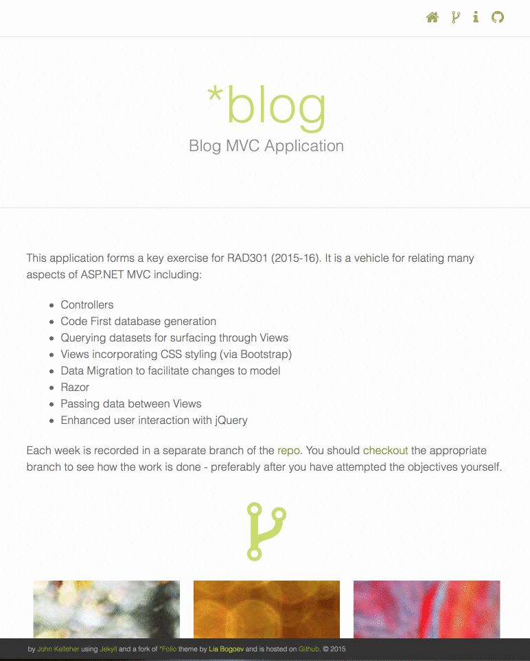

#New Jekyll Theme forked

I've been looking at [Jekyll](www.jekyllrb.com) for a while, particularly since giving no-db CMSs a spin. Static generated sites are a natural next step in that downward evolution. Jekyll comes up a lot in that realm given its support by Github - Github offers users both an account site and a per-project site, free hosting. Of course, you can push any regular html/css/js files to Github to avail of such hosting but that leads to how to generate those files in the first place.

[Staticgen](https://www.staticgen.com) lists a staggering **114** such static site generators with Jekyll leading the pack with over **21K** Github stars. There's even **4.5K** forks of the repo. It probably doesn't hurt that it's based on the popular Ruby language. I've played about with both [Hexo](www.hexo.io) and [Hugo](http://gohugo.io) mostly 'cause Jekyll doesn't play too nice on Windows though [not impossible](http://jekyll-windows.juthilo.com). But there's something neat about having Github do the building for you on every push so I took a closer look.

Mostly I have a need for a site for each repository I release to students. Github provides a relatively painless means of generating a single-page 'site' at *user_name.github.io/the_repository*. It can pull the README.md file and build the page around it according to one of a choice of themes. However, changes to the README.md file (likely in the master branch) won't propagate through to the **gh-pages** branch where the page is generated. This requires another re-generation of the page which can be tedious.

A better solution is to take control over the **gh-pages** branch and build your own page. For sites requiring more than one page there's no other option. Jekyll is pretty mature and so there's [plenty of themes](http://jekyll.tips/templates/). Most of these themes focus on the typical use-case of creating a blog. For my needs, I prefer a page to describe each branch. For that I found a theme ([*folio](https://github.com/bogoli/-folio)) by [Lia Bogoev](http://www.liabogoev.com/) which I [forked](https://github.com/jkelleher/folio) and amended for my own needs. Here's how it looks:

Lia's theme is MIT Licensed and so is the fork, so feel free to use.
