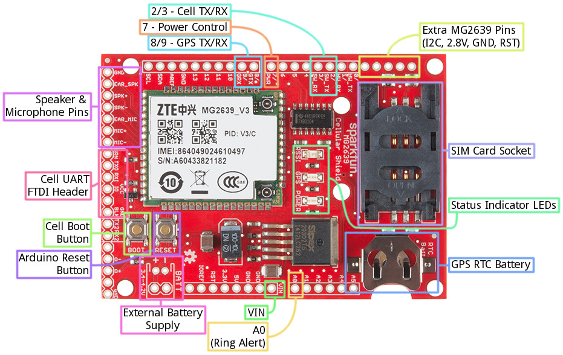

#Connecting IoT with GSM

IoT (Internet of Things) is big business but still in its infancy. At IT Sligo, this Jan (2016) we introduced a new Internet of Things [module](http://amm-json.itsligo.ie/module/web/28/COMP06208/201500/999999) as part of the new [Level 8 Computing (Hons) programme](https://itsligo.ie/courses/bsc-hons-degree-in-computing/). It's our first toe in the water of electronics and comes at the perfect time to capitalise on the IoT & Maker movement.

Having played (you can't call it anything else) with MCU (micro-controller units) in recent years - .NET Gadgeteer, Arduino and Galileo - I've always found the comms part the most tricky. One reason I like the [Arduino Yùn](https://www.arduino.cc/en/Main/ArduinoBoardYun) so much is its really well-thought out connectivity - wifi & ethernet. The upcoming Intel/Arduino [Genuino](https://www.arduino.cc/en/Main/ArduinoBoard101) is cheaper but still has Bluetooth which should play well with phones.

A recent project I'm working on needed good old fashioned GSM connectivity. Unfortunately, this is surprisingly expensive and hard to come by. The best candidate is Sparkfun's [MG2639 Cellular Shield](https://learn.sparkfun.com/tutorials/mg2639-cellular-shield-hookup-guide?_ga=1.229032410.712829862.1454778680). It isn't cheap (~£70) and that's before you add on the antenna, U.FL connectors and a beefier power supply (GSM is power hungry needing min. 9V compared to the usual 5V for maker stuff). You'll also need a SIM card and a ready supply of top-up cash while testing!
The MG2639 is of course a shield so it will sit atop an Arduino. I started with a [Mega 2560](https://www.arduino.cc/en/Main/ArduinoBoardMega2560) thinking I'd need a greater IO Pin array (there are expansion plans) but turns out I could get by with the smaller form factor of the [Uno](https://www.arduino.cc/en/Main/ArduinoBoardUno) - still need the 9V supply in addition to the USB hookup though thanks to the thirsty GSM module on the shield. Here's what it looks like with some annotation:

##Problems along the way
Okay, so far I've the hardware wired up together with a handy [Sparkfun serial-enabled LCD module](https://www.sparkfun.com/products/9395). This greatly simplifies the signalling to the LCD and consumes only a signal, 5V and ground on the host board (which given I'm using an Uno, is important).

1. Make sure you have the 9V power supply - these are not as common about the house as you might think - and given that it could fry some boards, this is just as well.
2. Find a SIM that works. First, make sure the PIN code for the SIM is disabled - put it in your phone and in Settings, turn off the PIN lock. Also, contact your provider to ensure voicemail is off. Also, we're talking full-size SIM here, not micro- or nano-. And finally, top it up.

