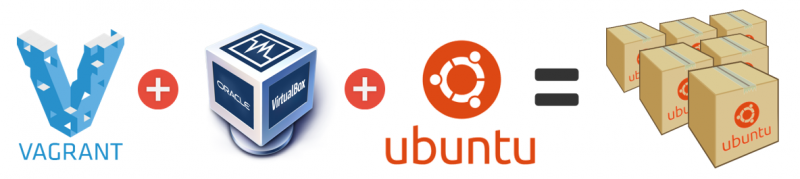
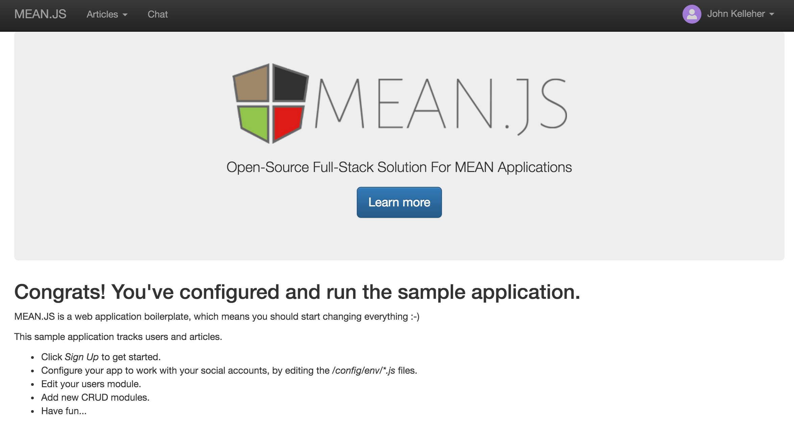

#Engineering a web dev environment

<iframe width="600" height="370" src="https://www.youtube.com/embed/9XraQkTCuJk?rel=0&amp;controls=0&amp;showinfo=0" frameborder="0" allowfullscreen></iframe>

Web development these days has quite a few moving parts. An important piece of the stack is the development box. It's convenient to just build off your own computer - especially since the development tools you like are customised just the way you like. On the downside, your collaborators setup won't be a perfect match. Ok, you package manager can look after a lot of this inconsistency but there's something very reliable and pure about building your app off a pristine, standard base - and that's where Vagrant comes in.

Vagrant works with another free bit of kit - VirtualBox - to make it ridiculously simple to spin up a VM (virtual machine) of your choosing. Vagrant has a bunch to choose from but Ubuntu does just fine. The clever bit that Vagrant provides is to expose a folder on the VM through to your dev machine. In this way, you can work with your own machine (and tools) while having the VM do the actual running of your code - basically, have your cake and eat it.

So how does it work in practice?

1. [Download](https://www.vagrantup.com/downloads.html) and install Vagrant (free)
2. [Download](https://www.virtualbox.org/wiki/Downloads) and install VirtualBox (free)
3. [Download](https://box.scotch.io/) and [install](https://github.com/scotch-io/scotch-box) ScotchBox - a fully provisioned and capable VM based (currently) around Ubuntu 14.04 LTS [Trusty Tahr](http://releases.ubuntu.com/14.04/). This has pretty much every library/package you need
4. You can right now browser to `http://192.168.33.10` to see your newly deployed server in action - the ScotchBox page will let you know what's installed on the server
5. Run `vagrant up` to spin up your VM - look to *VirtualBox* if you like to see the action. 
6. Now you are ready to build your app on the VM. Navigate to the parent of the `public` folder where you installed *ScotchBox* and install your *meanjs.org* code there. This involves a few simple steps:
     1. `$ git clone https://github.com/meanjs/mean.git public` - this pulls the *meanjs* repo into the public folder. You'll need to clear out (or delete) that folder to avoid git flagging a problem.
     2. Now `ssh` into the VM - if ScotchBox, you'll find it at `http://192.168.33.10` so use `ssh vagrant@192.168.33.10` (password: vagrant). Navigate to `\var\www\public` to find the mirrored folder within the VM. While we can (and should) edit the contents of the public folder from the host computer, you'll need to kick off the nodejs powered app from within the client OS.
     2. `npm install` - to get npm to pull in all the necessary packages. This will take a few minutes and you'll hear some fans spinning up!
     3. `grunt` or `npm start`  (which grunt calls for you). This will take another few seconds and then look to your host browser to see your app running at `http://192.168.33.10`

6. The benefits of using Vagrant here is that it already looks after the setup and running of the MongoDb server needed by *[meanjs.org](http://meanjs.org/)*. Doing this locally on your dev machine means an extra step to boot this server - with `mongod` and make sure the 27017 port is free.
7. Now, you can browse (from the host computer) to the running app at: `http://192.168.33.10:3000` - note the 3000 port is needed as *[meanjs.org](http://meanjs.org/)* runs your app there. Leave out the port and your VM is serving up whatever it finds in the *public* folder - which is probably just a folder listing.
8. When you're done, it's pretty easy to deploy the app straight from the VM to something like Heroku. Heroku is a great choice (free) and easily handled from the command line. You'll pay extra for the database at Heroku but instead choose [MongoLab](https://mlab.com/plans/pricing/) or [mLab](https://mlab.com/) - you'll get 500Mb for a sandboxed database - ample.
9. And finally, run `vagrant halt` or `vagrant suspend` to shut it down.

And there you have it - a modern web development environment. It's also perfect for sharing work as each collaborator just needs a copy of the same vagrant boxes (VMs) and they're assured of a common base machine. Any modifications to the base machine (VM) can be packaged into the packages.json file for npm to manage. Or (better), create a custom vagrant box and host it on [Vagrant Cloud](https://atlas.hashicorp.com/boxes/search?utm_source=vagrantcloud.com&vagrantcloud=1). Typically, though, you'll find something there already that works just fine.