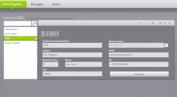

It’s been a while but we’re back to another project – the day job went into overdrive for a while. This time around we’re working with Silverlight again but as an out-of-browser app. I had looked at WPF for obvious reasons but the controls (e.g. DataForm, WCF RIA Services integration) were better rounded in Silverlight and I really like the themes (e.g. JetPack) that just aren’t ported to WPF. Our client is Tom from [Locus](http://locus.ie/), a firm based at the Business Innovation Centre at IT Sligo. Tom’s work involves helping his clients present complex spatial data in a manner which helps spot trends, make comparisons and draw inferences from the data – in essence, creating information visualisations from multivariate data. Tom wants to begin the process of better monetising his product. Currently, the output to his clients is a swf (Flash file) along with a collection of data in an xml file. The proposal is for an application to manage clients’ details and the products that they have purchased. The visualisation are licensed for a period of time and made available on a server for the client to download and consume as they see fit – typically, this involves their integration into the client’s own web site. With the proposed application, the licences will be better enforced by enabling/disabling access to the hosted visualisation files. Our work so far has brought us a reasonably complete database model with some populated sample data. The stack chosen is Silverlight, SQL Server Express 2008 R2 and we’ll be using VS2010 as the development environment. WCF RIA Services comes on board as the ORM (Object Relational Model) and Entity Framework as the .NET framework.

### Current Design

The Silverlight business application templates provided the colour scheme for the current design. As you can see, there are clients and there are what I term packages – info visualisations that are licenced to clients. I’ve chosen to separate the _Client Register_ from the _Packages_. The thinking here is that clients can exist without having licenced packages and vice-versa. If a client has packages licenced, then a link will be provided to go from the _Client Register_ page to the _Packages_ page. Likewise, the _Packages_ page will permit the assigning of a package to a client. The functionality at present lists the sample clients at left. Selecting a client presents full details on right (save Packages licenced). Through a ‘pencil’ icon at top right, you can edit the details and commit/reject changes – these options only enable should you make changes, and so are not shown in the screen shot. Above the client list is a search box that (on-the-fly) filters the list below as you type.

### Current Programming Choices

Currently, all the data is pulled down on initial load. This is favourable particularly since the data is held locally but even if not, there isn’t a large volume and there are benefits to having all the data locally cached. For example, the search box could have used a _DomainDataSource_ control to pass a query back to the database to filter the list. However, I’ve employed a _PagedCollectionView_ instead so that the querying can be done at the client and significantly improving performance. However, a little-known feature of the DataForm is that it doesn’t permit records to be added through a _PagedCollectionView_ so an alternative solution needs to be found. I’m hopeful that the _Packages_ page can be created reasonably quickly considering much of the design choices have been completed from the _Client Register _page. Our next focus is on how to use ftp to upload the information visualisation packages to the server. This will require the Silverlight app to run in elevated trust mode out of browser. Additionally, we need to be conscious of performance issues around the data access.

