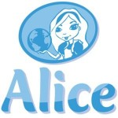

So, the old debate – what is the best first programming language to expose CS1 to? Heck, I remember when it was Pascal and C had to be handled with care. Then I think we took a wrong turn. As is often the case, thependulum swung too far the other way and we got [Scratch](http://scratch.mit.edu/), [Alice](http://www.alice.org/), and (though she’s cute as pie) [Kodu](http://research.microsoft.com/en-us/projects/kodu/). Now I like Kodu especially but Randy Pausch’s [work](http://www.youtube.com/watch?v=ji5_MqicxSo) on Alice is commendable. But I think within the limited confines of CS1 they perhaps represent a luxury that isn’t affordable. By year one end, the students need to have plenty exposure to _real_ programming – real loops, branching etc. – and not graphically simulated alternatives. I think they abstract away too much but they’re definitely of use at 2nd level to light the fire of interest.

So consider [SmallBasic](http://msdn.microsoft.com/en-us/devlabs/cc950524.aspx). I like it for a few reasons:

* It’s probably the safest IDE I’ve seen.
* It’s built on .NET so if you’re leading there, it’s a great fit.
* It’s peppered with help, guidance and intellisense.
* It demands syntax – but again a consistent dot notation that’s common to most newer languages.
* It comes with a decent ‘Getting Started’ guide – I don’t think anyone is going to teach this for longer than a semester.
* You can do graphical stuff, connect to Flickr, make simple games, handle interaction, do turtle-play a la Logo.
* It’s small and free
Programming is always a new frontier for CS1 but wrapping our students in the comfort blanket that is Alice et al, might just be too remote from real programming to help.
