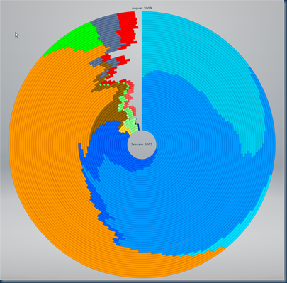

A example of good data [visualisation](http://www.axiis.org/examples/BrowserMarketShare.html) from W3School showing the changes in market share for various browsers since 2002 (Hail, Netscape). It’s interactive so you can hover to explore the detail. Note the near domination of Firefox and the growing Chrome presence.

Is it me or does this bear an uncanny resemblance to the Firefox logo?

{.img-center}

