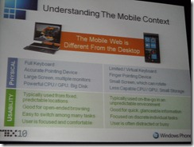
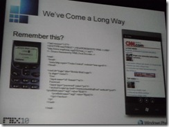
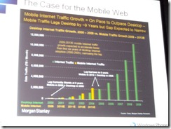

## [Joe Marini](http://www.joemarini.com/)

 

Joe begins by drawing for us the distinctions between mobile and desktop use – e.g. very task oriented, not just casual browsing. We expect information to be augmented by location, time – e.g. Avatar search should yield local show times. Also environmental affects (sunlight, noise) are a factor. We should provide the same information to both mobile and desktop but not necessarily the same presentation.

**Design for one web**: same content but differing presentation;

**Focus**: need to pick out a few key tasks to provide to users. Display them prominently a la above the fold. He speaks of ‘blink decisions’ by users – obvious what they should do.

**Clean, crisp, succinct**: few fonts/colours/graphics, no background images, scale down images, use short titles, use white space for separation;

**Minimise required input:** entering data tiresome and often on the move, use cookies to minimise input, provide default values

 

##Use Well-defined Standards

* Use minimum standard web technologies: XHTML, CSS 2.1, DOM 1, ECMAScript 3
* Specify DOCTYPE for your pages
* Use standard media types (jpg, gif, png, 3GP, avi, wmv, mp4)
* Avoid: framesets, tables for layout, nested tables, image maps, reliance on plug-ins or dHTML behaviours
* Mobile  Tags: use to flag pages rendered for mobile browsing. Ex. “HandheldFriendly” (RIM), “MobileOptimized” (MS)
* Viewport: document viewport is ‘windowed’ by screen viewport
* Multiserving Content: same page, different devices, styled right. Usually involves some kind of detection. Use script on client to detect capabilities. On server use code to detect User Agent string.

