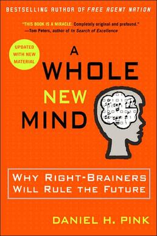
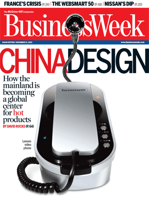
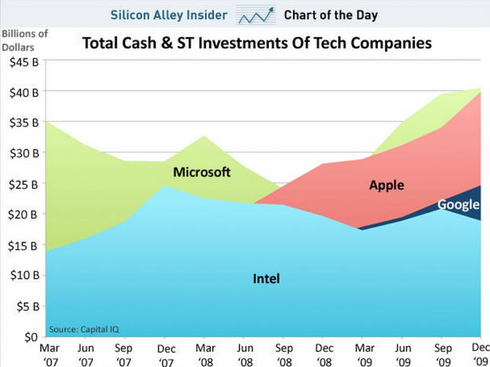

I’ve been reading an interesting best-seller recently - “[A Whole New Mind](http://en.wikipedia.org/wiki/A_Whole_New_Mind)” by [Daniel Pink](http://www.danpink.com/). As a self-confessed left-brainer (with right-brain ambitions), it can be frightening. As Daniel puts it there are three distinct (and currently realising) threats to the dominance of us logical, sequential, fact-finding folk – Asia, Abundance and Automation. He backs this up too – 350,000 engineering graduates every year, from India alone. He reminds us that software engineers in China can be had for a tenth that of the West. And they’re damn good too! [Detroit](http://news.bbc.co.uk/2/hi/business/6346299.stm) (USA) saw what automation wrought to the Big Four auto companies. “Mere survival today,” he says,” depends on being able to do something that overseas knowledge workers can’t do cheaper, that powerful computers can’t do faster and satisfies one of the nonmaterial, transcendent desires of an abundant age.” We do well not to underestimate the rise of the East. 

Okay, so we outsource our ‘grunt’ work to China but the high-value work, we keep here – we’re just moving further up the food chain – plenty of room for everyone. Maybe but China has more people working in [software](http://designative.info/2009/07/01/information-technology-in-china-software-industry-maintained-rapid-growth-in-2008/) than Ireland has workers, posting 38% pa growth in that sector since 2000. What do you suppose is the most popular major in Chinese universities these days? – Design. Output of industrial designers is up 2000% since the eighties. I just heard yesterday from a past student who works in South Korea and just got a place at a design school there. Disney just made their first movie wholly in China - The Secret Of The Magic Gourd. Until 25 years ago there was no such thing as a design course in Chinese colleges and universities; today, there may be as many as 500, and China is set to add 1,200 design schools to the 400 it has opened in the last two decades. Someone has eyes on the juicier fruit further up the value chain ([source](http://www.designcouncil.org.uk/Design-Council/3/Design-Council-Magazine/Design-Council-Magazine-issue-3/The-karaoke-economy/)). 

{.img-center}

That’s where as Pink says, we need to bring the right-side of our brain more into play. Right-directed thinking is a more holistic (inclusive) approach, focusing on the big picture (rather than specifics) and more to do with synthesising observations (rather then analyse). He doesn’t reject the need for left-directed thinking (don’t quit that IT programme just yet) but there are what he calls ‘high touch’ and ‘high concept’ senses that we need to nurture and develop. Pink’s Six Senses: 

**1. Not Just function, but also DESIGN** 

First it was about price, then about quality. Now we’re competing on design. Former CEO of Sony, Norio Ogha, says that Sony sets out with the understanding that their product competes with equally capable, functioning competition. The edge is design. 

**2. Not just argument, but also STORY **

A compelling and engaging narrative is essential to communication. We’re pre-disposed to listening when the content is wrapped in a convincing story. There’s a reason the movie industry is so big. 

**3. Not just focus, but also SYMPHONY **

Synthesis , or the ability to see the big picture, and being able to “combine disparate pieces into an arresting new whole” is key. In a quote from the book, the guy who invented the wheel was an idiot – the guy who put three wheels with it was genius. If you’re one of those left-brain guys who criticised the iPad for its lack of ****, then you’re failing to see the symphony of what it offers – a book, a music device, a shop, a mail centre, a cinema – and I _will_ pay to ensure it works. 

**4. Not just logic, but EMPATHY **

Forging relationships means caring. This isn’t necessarily some touchy-feely ‘let’s hold hands’ but a general consideration of the world from the users point of view. Google do this well. If I’m looking at Sligo in Google Maps and ask for directions to Dublin, it automatically figures I mean Dublin, Ireland. If I’m on my iPhone and look for ‘Jade Garden’, it finds me the way to my local Chinese and not say, the book, or tourist attraction. 

**5. Not just seriousness, but also PLAY **

There’s no rule saying we can’t try to enjoy our burgeoning interaction with services. It’s especially significant in areas such as education and entertainment. 

**6. Not just accumulation, but also MEANING **

Folk are seeking transcendence, something _more._ They’re after not just another laptop, but a style icon. They want to be part of something, not a consumer. Garr Reynolds (of Presentation Zen fame) also has a good (longer) post on these [six senses](http://www.presentationzen.com/presentationzen/2006/08/from_design_to_.html).

 

So maybe you don’t believe me. Have you looked at Apple recently? Follow the money – in terms of cash and investments, Apple is about to pass out Microsoft. And all this before the iPad main-lines into your wallet – actually, probably your Mom’s. Guess it’s time to stop looking down on our ‘creative’ brethren. Where’s my sketchpad?

