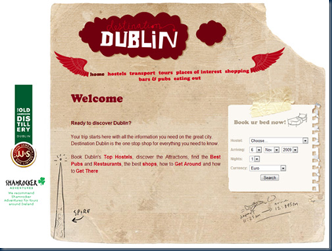

This collection from [Smashing Magazine](http://www.smashingmagazine.com/2009/10/23/showcase-of-web-design-in-ireland-2/) is a decent snapshot of the state-of-the-nation from a web design perspective.

 

The designers talk candidly about what seems to be a buoyant industry here-abouts. Decent showcase of sites follows.

One thing that raises it head is the perennial designer/developer debate and how third level can best serve the industry. Seems to me the industry churns incessantly in terms of tools, styles, fashions, needs – does this render traditional education channels impotent?

