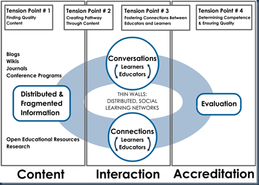

Recently we had some thought-provoking discussion about the future of a particular programme. Central to the debate was the skills our future graduate would possess (or should). Working in the tech field, it’s important to try to see as far to the horizon as possible. As [Ferris Bueller](http://www.imdb.com/title/tt0091042/quotes) put it so well: “Life moves pretty fast. You don't stop and look around once in a while, you could miss it.” It got me thinking about how we might prepare this mythical graduate for the world beyond. The world of the student over the coming years is changing rapidly. I think tech teaching is something of the canary in the mine – we’re seeing a marked reduction in the shelf-life for information. Books no longer capture the pulse of the industry. The landscape changes so rapidly that tech shifts are measured in months not years. The way we identify, the way we gather, the way we discriminate, disseminate and educate as well as assess, evaluate and motivate is set to change.

<iframe width="960" height="720" src="https://www.youtube.com/embed/dGCJ46vyR9o?rel=0&amp;controls=0&amp;showinfo=0" frameborder="0" allowfullscreen></iframe>

**Pop-fact**: While search engines (like Google, Bing) account for 37% of our step-off point for new information, 18% of us now use social media sites (blogs, Wikipedia, social-networking) to spearhead our research. We spend 10% of our online time in social-networking sites.

Reading Nade Oslo’s [recent talk](http://www.slideshare.net/gsiemens/nade-oslo?yourdomain=gmail) (at bottom), I came across this particular slide which neatly identifies the challenges ahead.

Oslo sees that the raw material of our education service is not solely self-generated but will increasingly derive from the community (of course, we are part of that community and will/do contribute). But the pace of change will progressively necessitate us mining the incredible rich vein of knowledge that lives on the net. This mining, while leading to a rich, current and relevant diet of material for our students will require up-skilling in techniques to extract this information. Right now, we’re not fully acknowledging this ‘tension point’ #1, as Oslo puts it.

Oslo’s #2 Tension Point is where we often misunderstand the notion of online learning. The prospect of developing sophisticated online material is often cited as an impediment to moving online. Such investments are neither practical nor affordable and don’t respect or appreciate the substantial contribution from the web community. Speaking from the perspective of computing (though I doubt other disciplines differ here), changes in tech outpace our capacity to absorb the material, let alone our ability to amalgamate and re-package it for consumption by our students. The tension point lies in marshalling technology to bind together online resources (once identified) making pathways through for our students to follow.

Right now the tools are there or emerging but not well known generally. As a case in point, I regularly use the following:

* personal class web site ([jk.itsligo.ie](http://jk.itsligo.ie/))
* personal blog ([jkelleher.blogspot.com](http://jkelleher.blogspot.com/))
* [Google Reader](http://www.google.com/reader/shared/15359737977812922619) to consolidate RSS feeds from tech community and beyond
* [Delicious](http://www.delicious.com/johnkelleher) to share bookmarks of useful resources
* [Twitter](http://twitter.com/johnkelleher) (because it’s expected, rather than necessary!)

Occasionally, I use the following tools for various purposes:

* [LinkedIn](http://www.linkedin.com/in/johnkelleher42) to keep in touch with industry and past students
* [YouTube](http://www.youtube.com/user/johnkelleher42) to publish videos (though class subject videos are hosted internally only)
* [Google Analytics](https://www.google.com/analytics) to monitor site activity and gauge interest
* [Google Calendar](http://www.google.com/calendar/embed?src=jkelleher%40itsligo.ie&src=poh2d7752jd80c29n5smsfko5o%40group.calendar.google.com&src=vu4qjjqf6q06b0pla5vdl8ntg4%40group.calendar.google.com) to communicate events, meetings, assessments, deadlines etc.
* [DropBox](http://www.dropbox.com/) to share files
* [Google Docs](http://docs.google.com/) to collaborate on work with colleagues
* [Facebook](http://www.facebook.com/jkelleher42) (because that’s where the students live!)

These are the tools (by and large) that students know and use – it’s the space they occupy after all. Many of these tools are not yet mature nor will all [survive](http://www.google.com/reader/view/#search/twitter%20growth/9) but the concept is the same regardless of the vehicle.

As we progress (begin?) our journey towards online learning, competency in the new medium will (need to) become mainstream. Just as we use our favourite sites because they address our needs (and not because they are pretty), the future provision of education will be judged (and with great immediacy) by how well the knowledge is mediated between the ourselves and our students.

So, what are we doing about it?

[Nade Oslo](http://www.slideshare.net/gsiemens/nade-oslo)

