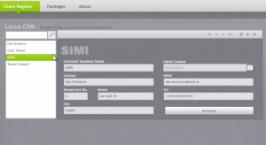

Happy to report that we have delivered our latest project - a customer relationship and licencing system for Locus Insight Ltd. under the stewardship of Tom Hobson. Tom's business produces bespoke visualisations to help represent large data sets. These he licences to clients ranging from the Irish Times to SIMI (Irish Motor industry representative body). The licences are offered at a rate for a particular duration and this licencing needs to be tracked. In addition, the system permits Tom to upload the visualisations to his server for distribution on demand to his clients.  The system is developed using Microsoft Silverlight 4.0 and SQL Server using Entity Framework and RIA Services.

