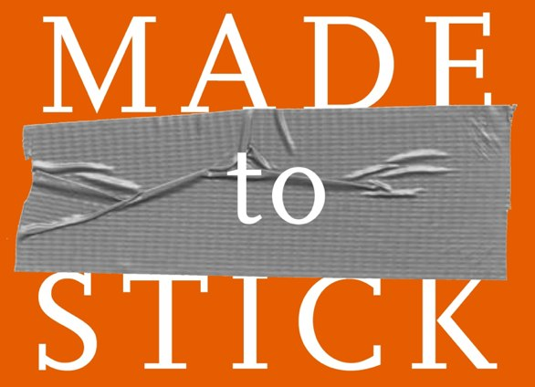
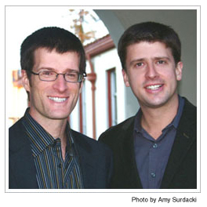

An excellent book by brothers Chip & Dan Heath. I couldn’t do it justice in this short post but the essence (for me) is the advice they give to help your message to reach your audience. They boil this advice down to a useful set of six metrics – SUCCESs. The book works well both in the business world and the lecture hall. They litter the book with plenty of convincing stories that hit home and nail the message.

* **S**imple: prioritise – what are we selling? why are we different?
* **U**nexpected: shock/alert – make your audience sit up; break conventions
* **C**oncrete: paint a picture – make it matter to your audience, make it accessible to them
* **C**redible: build reputation but also use authorities and anti-authorities (e.g. the brother of the deceased drunk driver)
* **E**motional: people care about people, not numbers; WIIFY (what’s in it for you)
* **S**tories: Stories drive action through simulation (what to do) and inspiration (the motivation to do it).
For more details, check out some [notes](http://www.slideshare.net/bizbooktalk/made-to-stick) on the net. But buy the book and savour each page.

