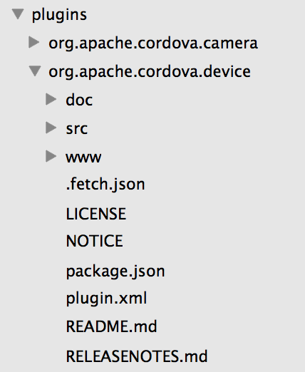
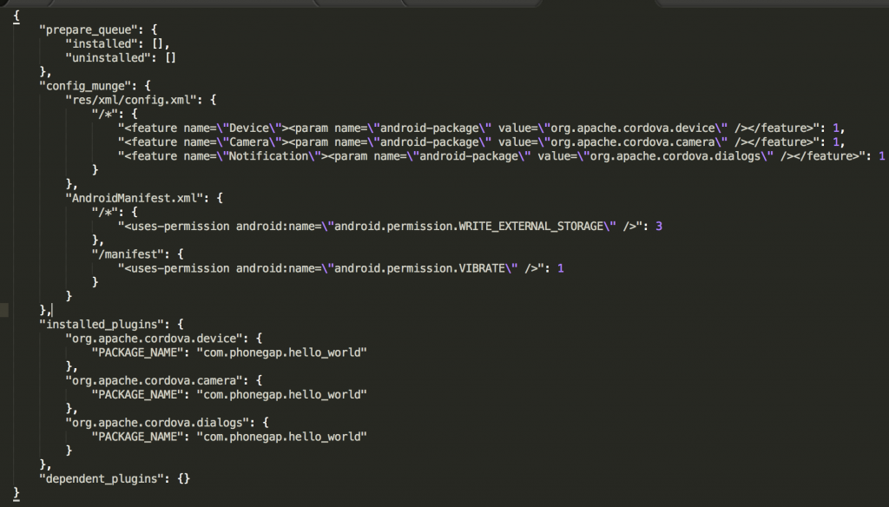

While currently working through a cross-platform app under Phonegap, I've run up against a number of issues. Frankly, these amount to deal-breakers for the technology so worth blogging. The app is reasonably straight-forward, taking a photo and uploading to the cloud. I've already deployed an iOS version and was testing out an Android version. First off, the documentation from Phonegap is weak. By that I mean, while there is reasonably comprehensive docs stretching back through many versions, there are dead links abound. In effect, you'll want to bookmark pages particular to your version so you can find them again. Also, there are way too many references to Cordova which while siblings, there are differences that will throw you. On to the specific issue. On deployment of the Android version to the device, I find Phonegap don't work. The checklist of things to look for is long, varies by version (and where you're looking) and how you're building your app. I use the CLI (command line interface) since each dedicated dev IDE (Ecclipse/XCode) has its own set of problems with Phonegap so I reckon it's best to keep close to the metal. Still, things to do...

### Config.xml

This is the source of much angst. Actually, there are many versions of this file so begin by mostly ignoring all but the one in the **www** folder. And yes, you guessed it, there are many **www** folders. Again, ignore any **www** folders in the **platforms** folders as these are over-written on each build of that platform. In config.xml you'll need to ensure that the necessary plugins are referenced as follows:

```
<feature name="Device"> <param name="android-package" value="org.apache.cordova.device.Device"/> </feature>
```

Each plugin needs a reference and additionally each plugin needs to be added through the CLI. A commonly reported fix to many problems is to remove these plugins via the CLI and to re-add. I've found that to work for some problems. Now take a closer look at the **value** argument above. Notice the repetition of _device_. This isn't reference name you'll find on the official repository at plugins.cordova.io - there you'll find _org.apache.cordova.device_. Nor is it correct on the Phonegap documentation that addresses this specific [point](http://plugins.cordova.io/#/package/org.apache.cordova.device). The way I came across this inconsistency was by tracking down the process whereby plugins added at the CLI are passed along to each platform specific file set. Here's the entry for the above plugin (Device) in the project folder structure. Notice the **plugin.xml** file. In there you'll find a reference similar to that above (with the double 'device' reference). So to reference this plugin for the Android platform, you need to dig about and find the correct **value** to use. Without it you will get the [popular ](http://stackoverflow.com/questions/11934974/error-initilizing-cordova-class-not-found) 'Class not found' error.  
 In the end, this is what the relevant part of my config.xml file looks like:
```
<feature name="Device"> <param name="android-package" value="org.apache.cordova.device.Device"/> </feature> <feature name="Camera"> <param name="android-package" value="org.apache.cordova.camera.CameraLauncher"/> </feature> <feature name="Notification"> <param name="android-package" value="org.apache.cordova.dialogs.Notification"/> </feature>
```

Some of this is just sneaky - look at the last two plugin references. Also, beware that if you're using Phonegap Build, there'll be lots of 'gap:plugin' references - these have nothing to do with the CLI. You need those to let Phonegap Build know which plugins you are using. On top of that you'll need to add those plugins manually via the Phonegap Build web site for your app. I grew weary of the other issues with Phonegap Build and hooked up real devices rather than the convoluted way in which Phonegap Build deploys to your device.

### Disclaimer

I've spent the better part of a day tracking this error down and reporting the findings. Previous to the 'Class not found' error, I was getting no error from Phonegap - just none of the device plugins would respond. I tried various things before identifying the above documented inconsistency. It's possible these efforts might help or explain other problems:

* Lots of advice directed me to remove the Android (or whatever troubling deployment) platform by just deleting the platforms/android, merges/android and android.json (or iOS.json). This did help with a problem at one point and in particular, inspecting android.json did point the way towards the inconsistent plugin references. I admit, I'm still a bit puzzled as to why all the referencing of these plugins!
* A little embarrassed to admit that I initially couldn't deploy to the Android device as it wasn't in developer mode. To do this, enter Settings...About Phone and look for Build Number (not Model number or Android version). Tap 7 times on this option - bizarre yes, but you stop reflecting on this after a while. Now, back out of the 'About Phone' screen. You now have a 'Developer options' entry on the Settings panel. In there, you can enable USB debugging and ready to begin your adventure.
* For a long time, my android.json file look sadly empty - just a few empty JSON arrays. I suspected it should have references to the plugins and in the end I did poke it into showing these. It's hard to parse what caused what after 8 hours hacking but do know that it should be populated - you'll see mine below for reference.


