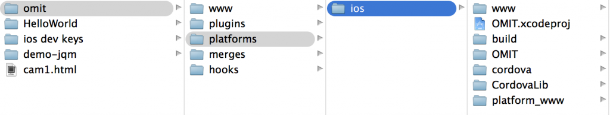

I looked recently at ways to create a prototype mobile app. The app in question requires access to the camera of the mobile device and possibly other native capabilities. Initially keen to use HTML5 and go full tilt with JS+CSS, there are still real limitations around employing these native features. I looked at other options but in the end settled on [Phonegap](http://phonegap.com) (aka Cordova). This hybrid approach has a pretty tight integration with the SDK for  many mobile platforms. The idea is that you engage the native capabilities of mobile platforms through js wrappers that hijack your request and funnel it through to the native OS. Mostly, you code once and deploy everywhere - okay, we're not there yet but getting close. But the realities of working in this space are sobering. Even working off a Mac, you'll be pulling together a host of tooling to push out an app. The general setup is:

* Download the Phonegap framework using npm - this works well globally providing support for using Phonegap
* For iOS you'll need [XCode](https://itunes.apple.com/en/app/xcode/id497799835?mt=12), free from the AppStore but you'll need $99/yr to get a developers licence - you'll not get far without it, not even deploy to your own device. If you're thinking emulator, think again as even the camera won't/can't work there. You can try an extension ([Ripple](http://www.raymondcamden.com/index.cfm/2014/1/17/Installing-and-Using-Ripple-for-Cordova-Development-A-Video)) to Chrome which will try to show you what it would look like but there are enough problems with out introducing another layer.
* Install whatever versions of your app i.e. iOS, Android and Win8 using '_phonegap platform add ios_'
* Add whatever plugins you need to cover the device capabilities you want: e.g. 'cordova plugin add org.apache.cordova.device'. This is different in Phonegap 3.0 and later - before that, these were automatically included.
* If using Phonegap Build (and you likely will to make cross-platform building easier), you'll need to add plugins to tell Phonegap Build that you're using certain device APIs. Do this by editing the correct copy of the config.xml file. This is _not__ _the one in platforms/ios or platforms/android but rather the one in **www**. I find it best to avoid editing in XCode (though I run from there) as it prioritises the www folder from the iOS folder rather than the root one - and this www folder gets over-ridden on every build. For a list of plugins to add to your config.xml file, refer [here](https://build.phonegap.com/plugins) and add the (several) _gap:plugin_ lines to the file.
* If you get 'unbuilt' or 'error' on Phonegap Build when making iOS apps, check that you have your P12 signed key and Provisioning file uploaded. Even if you do, the 'unbuilt' error can be fixed by uploading again.
* Build your app using 'phonegap build ios' or 'phonegap build android'

Now that will get you only so far. The structure of the project folder is worth paying close attention to. There's a 'www' folder in the root of the project folder. This is the actual html5 site that Phonegap takes and re-generates copies for each platform you're targeting. You can edit the iOS project in Xcode by opening the project file (the .xcodeproj file above right). However, XCode is probably not the best place to work on the project (even for an iOS app). The www folder in the iOS folder shouldn't be edited but XCode wants to only deal with stuff in the iOS folder.

Instead, I recommend using XCode to build and run (either emulator or device-hosted) and use Sublime (or similar) for the better (imo) editing experience. There is still that problem with XCode thinking that the www folder in the iOS folder is the one to work on. However, as I said, Phonegap generates that folder from the 'master' www folder in the project root folder (omit above). So to push the new version of 'www' into each of the targeted platforms, you're better off using the Terminal client. As you saw above, Phonegap is installed using npm and the (necessary) plugins are similarly installed. To build your app, run 'phonegap build iOS' (or similar). You can also run the app from 'phonegap run iOS' but I found difficulties with this, despite earlier success. Nonetheless, just building with phonegap pushes the updated www folder to the appropriate platform so you can run the app from XCode. Or you could push it to Phonegap Build...

[Phonegap Build](https://build.phonegap.com) is a beta cloud-building service offered by Adobe. It's pretty convenient as it means you don't have to install all the various SDKs for iOS, Android etc. on your local machine. It connects with your Github account and easily pulls the latest commit and builds (as many of) the platforms you specify. It does need a config.xml file to direct Phonegap as to how you want it built (what plugins, what platforms etc.). You also have to specify the developer keys and provisioning details which are tricky to acquire in the correct format. But when it works, it's pretty neat. It even throws out a QR code that you scan with your phone which then prompts the installation of a bootstrap app on your device. Running this bootstrap app pulls down the latest build from Phonegap Build servers. You can even have a 'hydrate' facility whereby the device bootstrap app will check for newer versions, download it and run the new updated app. You can do all of the Phonegap Build work in the Terminal too which keeps you centred on the bash shell. I'm not confident of debugging yet but here's a good [roundup](http://www.raymondcamden.com/index.cfm/2013/12/10/Article-An-Overview-of-Mobile-Debugging-Techniques--Part-One) of the options.

#### Playing with both Build and local running

There is potential for problems when targeting both local building and remote Phonegap building. Local is faster especially if you're using a connected Git repo to feed Build. Naturally, this is better for sharing. On the other hand, all that adding and pushing can be overkill when you just want to test a feature. So you may want both around to play with. One issue I encountered was that I often seemed to loose plugins from my local iOS platform. Now, they would still show when I asked: 'phonegap plugin list' but on trying to add the plugin (using 'phonegap plugin add org.apache.cordova.camera'), it would succeed in adding and not give any 'already existing' reports. So this indicated that it wasn't actually there though the plugin list reported it as such. And running the app showed the plugins now working again. Another issue worth noting is that locally running an iOS app to a connected device means that any previously installed Phonegap Build edition of the app would cause that previous app to be deleted. I'm guessing the device won't accept two apps with the same AppId and kills the earlier one. This is a bit messy as the install for the Phonegap Build versions is tedious what with the QR code, followed by install, followed by some hydration of any newer version. Add to this the extra overhead of git handling and pulling the latest build within Phonegap Build and you'll see that you probably will only revert to Phonegap Build when you need production app or you need to see what it looks like on a different platform that you don't have emulators/SDK for locally.

#### Useful Resources

* Christophe Coenraets - a thorough [walkthrough](http://ccoenraets.github.io/cordova-tutorial/) using Cordova, so some differences with Phonegap though up-to-date at v 3.0
* [DevGirl’s](http://devgirl.org/2013/09/05/phonegap-3-0-stuff-you-should-know/) Blog has a useful snapshot of changes (some important) that Phonegap 3.0 brought. Particularly good explaining the goings-on with the www folder and the config.xml file.
* Raymond Camden has a similar [checklist](http://www.raymondcamden.com/index.cfm/2013/10/1/PhoneGap-Build-and-PhoneGap-30) of things to watch for with Phonegap 3.0 and in particular Phonegap Build.
* [Installing](http://stackoverflow.com/questions/19045466/phonegap-3-phonegap-install-ios-error-no-platforms-added-to-this-project) ios-sim for invoking emulator using Terminal for Phonegap.
