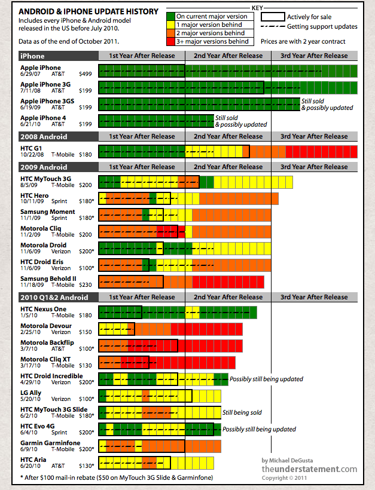

####Quo Vadis

This post is all about predicting the future (sadly, not in the Alan Kay way of [inventing the future](http://www.smalltalk.org/alankay.html)) for the next development platform. At [Appsolo](http://www.appsolo.com/), we've developed a number of reasonably complex line-of-business systems with some focus on UI. Coming as we do from a background of MS, we took our .NET knowledge and coupled it with Silverlight to provide a cross-browser, highly interactive UX solution to any number of needs. It's time to reassess that decision in light of where the market is going and with the benefit of our experience of that 'extended test-drive'. For those with short attention spans the take-away point is: Silverlight is terminally ill and the disease is partly MS but mostly the industry. It's what makes the business so much fun but it can be a little stinging when you have to say goodbye to a platform that for better or worse has taken a lot of your attention over, in our case, 2-3 years. I like the idea of Silverlight. Here's the up-side:

* The mark-up for the UI is comfortably easy to separate from the code-behind. 
* The tools (VS2010/Blend) are competent and best in market. 
* MS makes the tools largely free to develop and deploy.
* Community support is broad and deep and shows no sign of abating given the number of .Net [developers](http://ezinearticles.com/?Dot-NET-Developers-in-High-Demand&id=6684062).
* It scales well and executes well.
* It provides good coverage catering well for line-of-business apps.

Now the downsides:

* MS is screwed up. Okay, unfair, but sometimes it feels there are whole divisions there that aren't aware of the direction other divisions are heading. Currently, it seems they realise this is a bad thing and are saying nothing - an improvement, I guess. For example, the stupefying silence in the months running up to Build last Sept '10 only stoked the discontent among developers. What was announced is still very unclear and certainly does nothing to assuage the anxiety among those who have invested in Silverlight. Developer support is key to success for any platform and it amazes me how MS treats this valuable resource with this absence of clear direction. I don't see how MS can embrace all that is good about HTML5 and on the other hand support Silverlight - they're chasing the same ball.
* .Net is complicated. Often, even the simplest things can cause immense pain. I recall spending 'long time' getting a simple combo-box lookup working in a data form. Things that common should be handled well. Equally, data binding is a great thing in theory but in practice without debug support, it's like trying to find your way out of a darkened room.
* As apps start to become increasingly distributed across client and server, I'm not sure the one-stop shop solution of Silverlight works. Keeping track of the _n_-tiers across an app and their interplay becomes tricky. I'm more inclined to employ web services to create bulk-heads between the various responsibilities.
* The tools while brilliant in places are still under-whelming for XAML creation and debugging.

**The Real Problem with Silverlight** Silverlight has grown up but so has the web. We're entering the post-plugin era. Web is becoming mobile - and in a hurry. New devices are populating the web space ranging from cellphones, through tablets, ultrabooks, desktops and televisions. These devices will pollute the destination space for our web apps (and they're all apps now, no longer sites). Right now businesses (and developers) are struggling to target the Apple [AppStore](http://itunes.apple.com/us/genre/mobile-software-applications/id36?mt=8), Android [Marketplace](https://market.android.com/?hl=en), [Blackberry App World](http://us.blackberry.com/apps-software/appworld/) (and a few at Windows Phone [Marketplace](http://www.windowsphone.com/en-US/marketplace?wa=wsignin1.0)!) not to mention the desktop and web.All these have very different development stacks. I can't see this as sustainable from a development perspective. However, equally, I don't see this space simplifying. There's too much market to chase and plenty market segments to target. For example, Apple are content to (currently) address the AB socio-economic group. Android, given Google's price for the OS (free) is helping the likes of HTC and Samsung flood the B2DE (lower-middle and below) with cheap handsets - watch as the continent of Africa takes off. The market for smartphones is huge - China has 122m people who do not yet have an Android/iOS phone - and can afford one.

**The Answer**
 {.}
But as developers we need a way to address these disparate platforms. The web, in short, is the answer. And after a few [false dawns](http://www.cio.co.uk/news/118544/w3c-drop--xhtml-2/), HTML5 is [widely accepted](http://macs.about.com/b/2010/04/30/microsoft-joins-apple-in-backing-html5.htm) (Apple, Microsoft, Adobe, Google), rapidly [developing](http://www.html5code.com/tutorials/understanding-the-html5-timeline/) and provides excellent coverage. By HTML5, I mean html, javascript and css3. All of these have matured well in recent years. They provide excellent application at the client end. CSS3 rivals the best of Silverlight styling. Javascript has some excellent libraries that leverage its exalted position as the only widely supported client-side executable language:

* [JQuery](http://jquery.com/)
* [Mootools](http://mootools.net/)
* [Prototype](http://www.prototypejs.org/)
* [Processing.js](http://processingjs.org/)

This development services not only web browsers, but rapidly is supplanting desktop apps in the process. With improvements in browser [performance](http://www.tomshardware.com/reviews/web-browser-performance-standard-html5,3013-15.html) and older, less html5-compliant (goodbye [IE6](http://www.ie6countdown.com/)!) browsers rapidly disappearing - [even MS](http://technet.microsoft.com/en-us/ie/dd365125) is moving to auto-upgrade from IE8 - this trend will continue. Add the cloud to the mix, on-the-go access and employer's acceptance of more [flexible work practices](http://www.siliconrepublic.com/strategy/item/24552-25pc-of-firms-dona-t-have), the need to limit an app to the desktop is disappearing.

