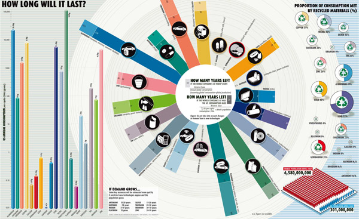

[Armin Reller](http://www.infographicsblog.com/how-long-will-it-last-armin-reller-tom-graedel/) of the University of Augsburg and Tom Graedel of Yale University created this infographic showing the consumption of key minerals and materials and how little stocks remain, particularly if US-like consumption patterns continue.

