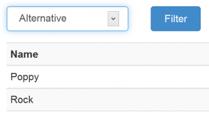

Creating a dropdown list shouldn't be complicated but off-times, it can prove difficult to engineer. There are subtle issues for sure but for such a common feature of a UI, it should be more transparent. To take a concrete example, I'm seeking here to create a simple DropDownList showing the contents of a single field drawn from a 'Genre' table. Since we're using ASP.NET MVC, we begin with the _Action method_ which will populate the dropdownlist.

```
public ActionResult Index(string chosenGenre)
{
ViewBag.genreList = db.Genres.Select(g => g.Name).Distinct();
var model = db.Genres.Where(g => g.Name.Contains(chosenGenre) || String.IsNullOrEmpty(chosenGenre));
return View(model);
}
```

The first line in the method pulls the necessary field from the table and removes duplicates. The next line retrieves only those _Genre_ records that match the parameter (or takes all records if no filter passed). The last line pushes the retrieved data to the _View_ to render the display. Here is the relevant part of the _View_:

```
@using (@Html.BeginForm("Index","Genre", FormMethod.Get, new {@class="form-horizontal", @role="form"})){
        <div class="col-sm-2">
            @Html.DropDownList("chosenGenre", new SelectList(ViewBag.genreList), new{@class="form-control", onchange="$(this.form).submit();"})
        </div>
        <div class="col-sm-1">
            <button class="btn btn-block btn-primary">Filter</button>
        </div>
      }
}
```

After the _View_ receives the data payload, the above Razor/HTML code offers a form to enable the user to engage with the DropDownList. The Razor HTML helper is an easier means of generating the <select> tag and enables us to inject various other options. The various params for _BeginForm_ are:

1. Action method for the specified controller (to follow next)
2. Controller from which the above Action method is invoked (allows us to pass control to another controller)
3. Specify the HTML verb - in this case, a benign retrieval of data from the server
4. Various html attributes - here, tapping into some Bootstrap classes for display purposes

The *DropDownList* helper creates the <select> control and employs the following params:

1. Name of query parameter, this to be passed back on postback and interpreted by the invoking _Action method_
2. Creates a _SelectList_ object from the data loaded into the _ViewBag_ in the _Action method_
3. Some html attributes to style and some javascript event handling to invoke the _Submit_ button when the input box is changed, obviating a click of the button
This example is relatively straightforward. We can (and typically would) employ a call to the HTML helper - Ajax.BeginForm() - rather than the above and have it inject the returned partial view into the specified _View_ Here's an _Action method_ from a _AlbumController_ which employs this tactic:

```
public ActionResult Index(int chosenGenre = 0)
        {
            // Populate a ViewBag property to hold a collection
            // Each object in this collection has a Value and Text property
            // The Text property holds the string to display in the dropdownlist
            // The Value property holds the id to be returned as the SelectedValue for the dropdownlist

            ViewBag.genreList = db.Genres.Select(g =&gt; new { name = g.Name, id = g.GenreId }).Distinct();
            // Query the Albums collection to retrieve the Albums matching that Genre or return all if no chosen Genre
            var model = db.Albums.Where(a =&gt; a.GenreId == chosenGenre || chosenGenre==0);
            // Render the appropriate view passing along data to display
            if (Request.IsAjaxRequest())
            {
                return PartialView("_Albums",model);
            }
            return View(model);
        }
```

The populating of the _ViewBag_ payload is similar though this time I'm passing a collection of anonymous types. Each item in the collection has a _id_ and a _name_. The _id will be passed back to the same _Action method_ where we will use it to filter the records. The *name* property will be used for display purposes in the select list. The second line does the filtering of the records according to the passed param _chosenGenre_. The _if_ statement checks to see if the method was invoked on the back of an Ajax request or not. If so, this means the filter at the browser has been invoked, otherwise if not, then it is the case that the page has simply been visited via a link or directly entered URL._ _ Note the difference in how the request is handled.

The non-Ajax reply is to pass the data payload back to the corresponding _View_. The Ajax reply is to send back a partial view to be rendered, called '_Albums_'. The partial view simply iterates over the collection of records. The full view will have the usual chrome that the master page (_layout.cshtml_) would provide. Here's the Razor code that is subsequently rendered - first off the non-Ajax approach:

```
@using (@Html.BeginForm("Index","Album", FormMethod.Get, new {@class="form-horizontal", @role="form"})){
    <div class="row form-group">
        <div class="col-sm-2">
            @* param1: id of control to return value selected  *@
            @* param2: new SelectList object with provided data list, property to hold id, property with display text, initial id  *@
            @* param3: 'Show All' option
            @* param4: apply Bootstrap styling  *@
            @Html.DropDownList("chosenGenre", new SelectList(ViewBag.genreList,"id","name",0),"All Genres", new{@class="form-control"})
        </div>
        <div class="col-sm-2">
            <button class="btn btn-block btn-primary">Filter</button>
        </div>
    </div>
}
```

And now the Ajax approach:

```
@using (@Ajax.BeginForm("Index","Album",
    new AjaxOptions{InsertionMode = InsertionMode.Replace, UpdateTargetId = "AlbumList", LoadingElementId = "loader"},
    new {@class="form-horizontal", @role="form"})){
    <div class="row form-group">
        <div class="col-sm-2">
            @* param1: id of control to return value selected  *@
            @* param2: new SelectList object with provided data list, property to hold id, property with display text, initial id  *@
            @* param3: 'Show All' option
            @* param4: apply Bootstrap styling  *@
            @Html.DropDownList("chosenGenre", new SelectList(ViewBag.genreList,"id","name",0),
                    "All Genres", new{@class="form-control", onchange="$(this.form).submit();"})
        </div>
        <div class="col-sm-2">
            <button class="btn btn-block btn-primary">Filtering</button>
        </div>
        <div class="col-sm-2">
            @Html.ActionLink("Create New", "Create", new {@class="btn btn-md btn-default"})
        </div>
    </div>}
```
